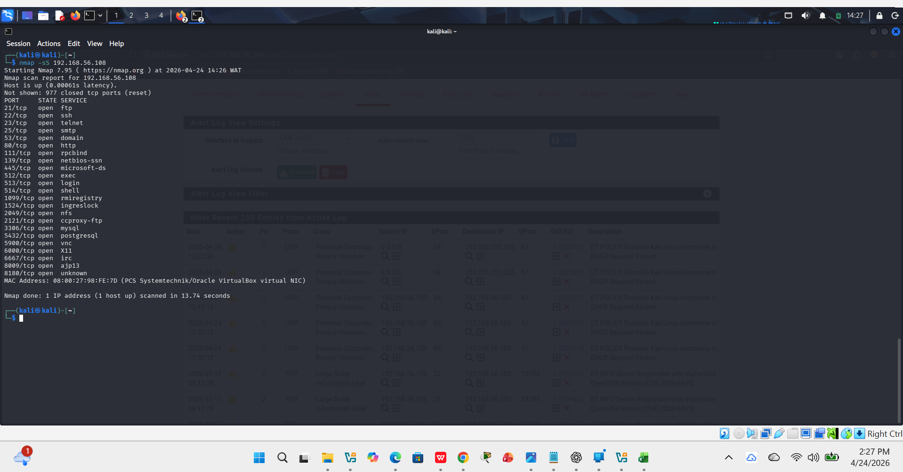
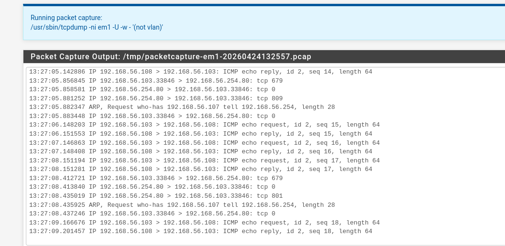
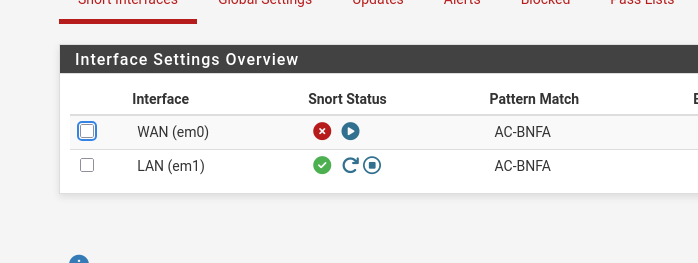
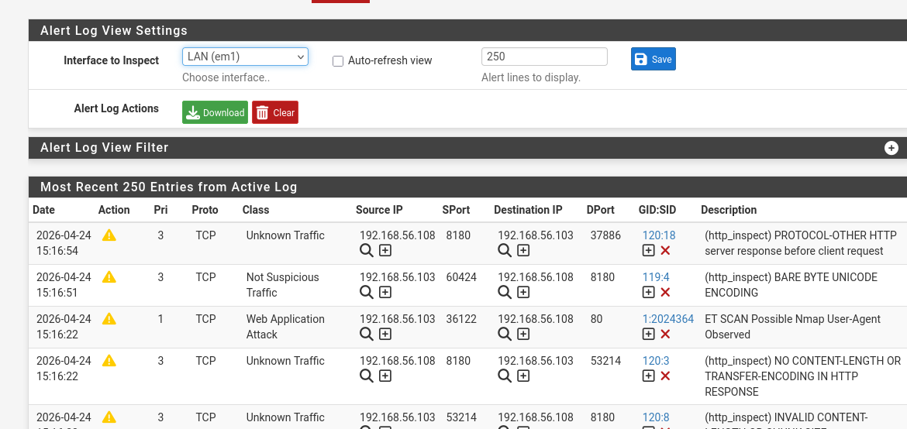
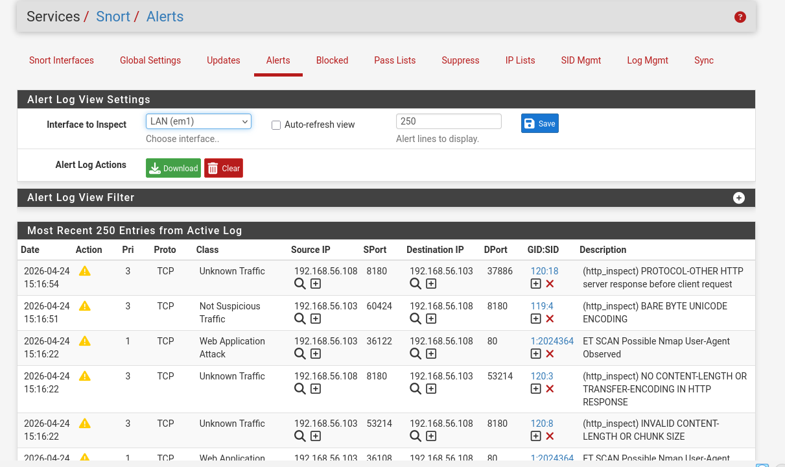
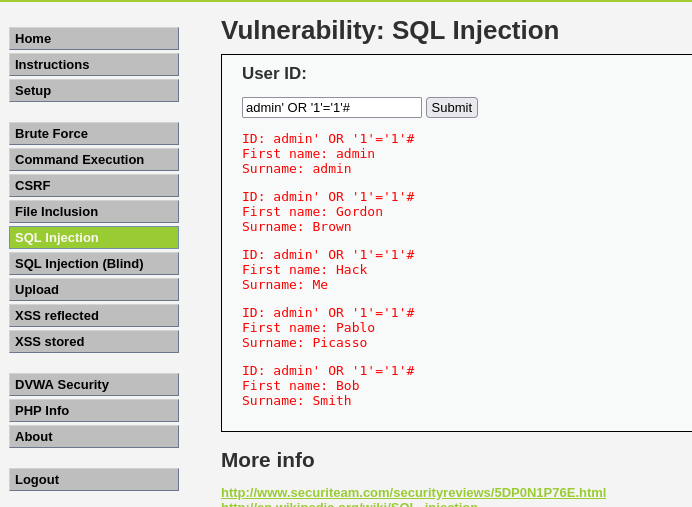

# 🚀 INTRUSION DETECTION LAB  
## Snort IDS Deployment & Packet Analysis

---


## 🧾 OVERVIEW

This project simulates a real-world SOC environment by deploying a network-based Intrusion Detection System (IDS) using Snort on pfSense.

Attack traffic was generated from Kali Linux against a vulnerable Metasploitable target, and alerts were analyzed using IDS logs and packet inspection techniques.

---

## 🎯 OBJECTIVES

- Deploy Snort IDS in a segmented lab network  
- Simulate reconnaissance and web-based attacks  
- Analyze IDS alerts and captured traffic  
- Evaluate limitations of signature-based detection  

---

## 🧰 TOOLS & TECHNOLOGIES

- Snort (IDS Engine)  
- pfSense (Firewall Platform)  
- Kali Linux (Attacker Machine)  
- Metasploitable (Vulnerable Target)  
- Wireshark (Packet Analysis)  

---

## 🏗️ LAB ARCHITECTURE


Kali Linux (Attacker)
↓
pfSense + Snort (IDS)
↓
Metasploitable (Target)


All traffic flows through pfSense, where Snort performs real-time inspection.

---

## 🔍 ATTACK SIMULATION

---

### 🔹 1. NETWORK RECONNAISSANCE

#### Command Used
```bash
nmap -sT -T4 192.168.56.108

Detection Results
ET SCAN Possible Nmap User-Agent Observed
HTTP anomalies detected via http_inspect

🔹 2. SQL INJECTION (DVWA)
Payloads Used

' OR 1=1-- -
UNION SELECT null, version()-- -
admin' OR '1'='1'#


Exploitation Results

Database information successfully extracted
Authentication bypass achieved
Multiple user records retrieved


Detection Outcome
No direct SQL injection alerts generated by Snort
HTTP anomalies detected instead

## 📸 screenshots

---

### 🔍 Nmap Scan Execution  


---

### 📡 Packet Capture (Traffic Visibility)  


---

### 🛡️ Snort IDS Running on pfSense  


---

### 🚨 Snort Detection of Nmap Activity  


---

### ⚠️ HTTP Anomaly Detection (Snort)  


---

### 💥 SQL Injection Exploitation Results  


---

🔍 ROOT CAUSE ANALYSIS

The lack of SQL injection detection is due to:

Signature-based detection limitations
Insufficient payload complexity
Application-layer nature of SQL injection attacks


⚠️ LIMITATIONS
IDS visibility is limited at the application layer
Detection depends heavily on predefined signatures
Clean or simple payloads may bypass detection


🔐 RECOMMENDATIONS
Integrate a SIEM solution (e.g., Wazuh) for log correlation
Develop custom Snort rules for SQL injection detection
Implement a Web Application Firewall (WAF) for deeper inspection


🧩 MITRE ATT&CK MAPPING
Technique	Description
T1046	Network Service Discovery (Nmap scanning)
T1190	Exploit Public-Facing Application (SQL Injection)


📊 OUTCOME
Successfully deployed and configured Snort IDS
Simulated real attack scenarios
Validated detection capabilities and limitations
Produced actionable security insight


